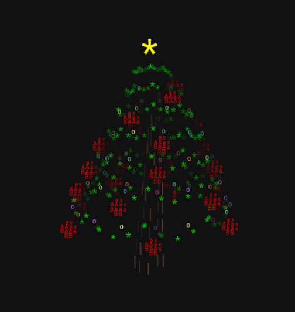

# ASCII Rendering 🎨

A fun project that renders animated 3D-inspired ASCII art scenes directly in the browser.

---

## 🎮 Scenes Available

* **Xmas Tree** 🎄 - Festive ASCII tree with ornaments
* **Bomb** 💣 - Rotating ASCII bomb

Use the dropdown menu in the app to switch scenes.

---

## 🖼️ Preview



---

## 💡 Inspiration

Inspired by the aesthetics of the **Effulgence RPG** game, blending retro text-based visuals with modern rendering techniques.

---

## 📄 License

This project is open-source and available under the MIT License.

---

## 📦 Installation

```bash
git clone git@github.com:vanflux/ascii-rendering.git
cd ascii-rendering
npm i
```

---

## 🛠️ Usage

### Development

```bash
npm start
```

Go to `http://localhost:3000`.
